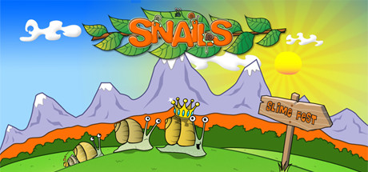

# Snails

They are slow and dumb, and they sure need you!

Snails is a 2D platformer/puzzle game where the main objective is to help the snails reach the level exit.

There are 4 different game modes: The Escort, in which the player needs to take the snails to the exit. The Exterminator, in which the player has to kill all the snails. The Snail King, in which there’s a special snail, The King, that the player has to take to the exit and must be kept alive. Finally, Time Attack, in which the player has to take the snails to the exit within the time limit.

There are multiple ways to finish the levels and some ways are better than others. The player is awarded with 3 types of medals depending on the score : Gold, Silver and Bronze. The score depends on the time taken, the number of snails escorted and the coins collected.

Main features
84 Levels
4 Themes
Achievements
Replayability, the same level plays in different ways
Supported languages: English, French, Italian, German, Spanish and Portuguese
Hours of gameplay

Get ready to be challenged, get ready for Snails!

## Free to Play

Snails is now Free to Play on your common platforms like Steam.
Hope you enjoy the game and perhaps use this source code to create new game levels.

Download from Steam: https://store.steampowered.com/app/353260/Snails/

Download from Itch.io: https://xesf.itch.io/snails

## Open Sourced

This game is very close to our hearts, it has been more than 2 years of dedication after working hours to create this game. We believe the engine we have created can help other indie developers or new comers to XNA/FNA/MonoGame Frameworks to use it or learn from it.

If you do find it interesting and you use parts of our code we'd love to hear it from you.

## Licence
This source code is licensed under the [GNU General Public License](LICENSE).

Please note this license only applies to Snails engine source code. Snails game assets (art, sprites, textures, audio, etc.) are not open-source and therefore aren't redistributable.

## Credits

### Designed and Developed By
Alexandre Fontoura

Jorge Lima

### Art
Jorge Lima

### Music
Rui Querido

### Additional Levels
Francisco Ferreira

### Special Thanks
Adrien Grandemange

Emilio Bologna

Lennart Böwering

Leonor Cachapuz

Marisa David

Michelle Silva

Miguel Lima

Rodrigo A. Gusman

### Additional Sound Effects
http://www.freesfx.co.uk/

